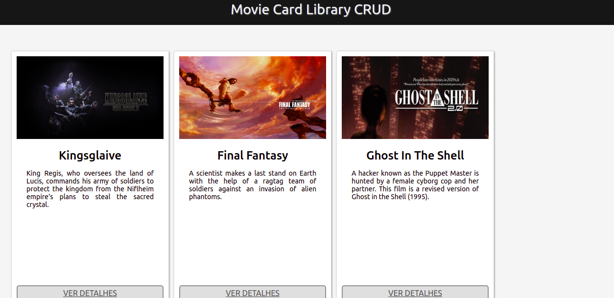

# Welcome to the CRUD Movie Card project repository!

## https://movie-card-library.vercel.app/--

The acronym ** CRUD ** stands for, _Create, Read, Update and Delete_, so it should be possible to perform the following operations on this project:

   - Add a new movie to the list - ** CREATE **;
   - List all registered films, with a summary information page about each film and a detailed information page for a selected film - ** READ **;
   - Edit a movie in the list - ** UPDATE **;
   - And delete a movie from the list - ** DELETE **; 

#### Tech
- ReactJs
- JavaScript
- HTML5
- CSS

---------------------------------------------------
Esta aplicação é um CRUD (_Create, Read, Update and Delete_). Então o usuário deve poder executar as seguintes tarefas: 
- Adicionar um novo filme a lista,
- Exibir todos os filmes listados, com uma informação resumida. Ao ser clicado, o filme deve mostrar informação detalhada,
- Editar as informações de algum filme da lista,
- Deletar um filme da lista.

